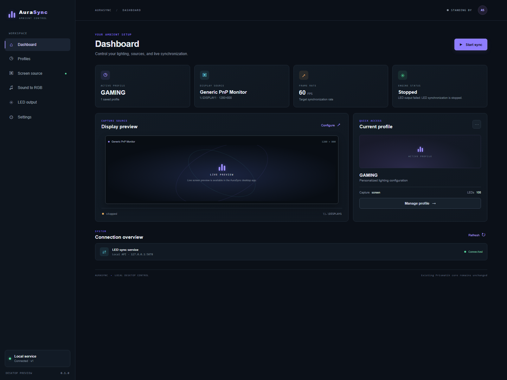
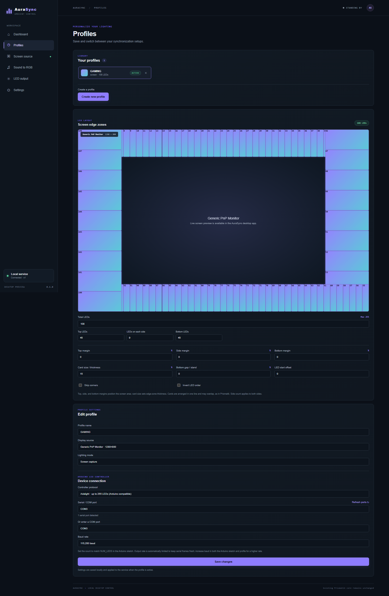
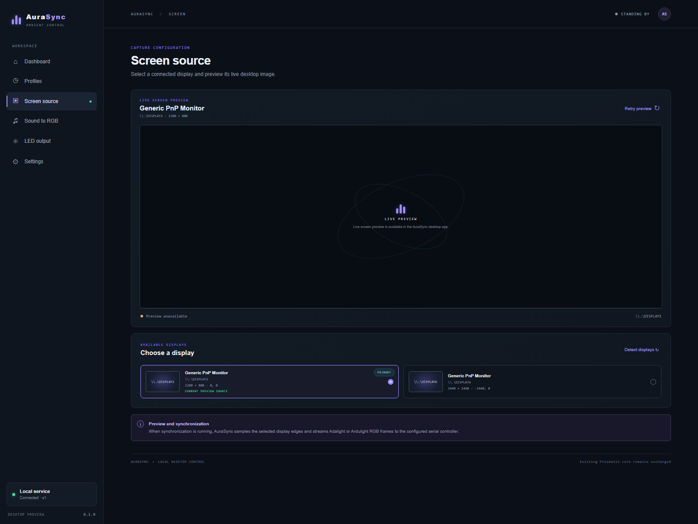
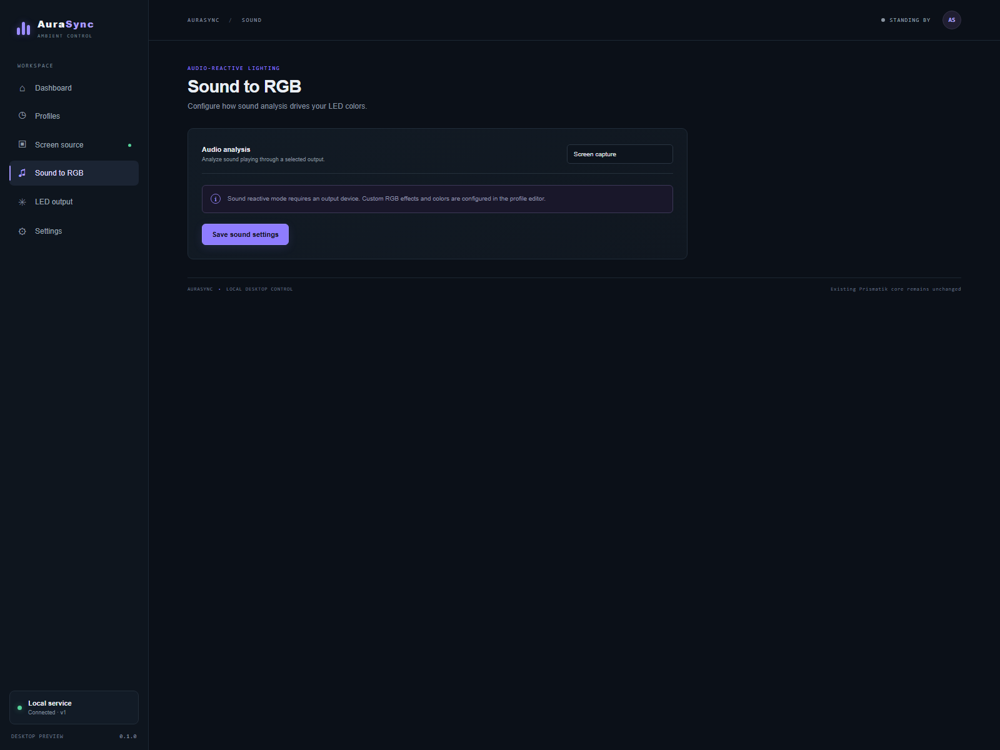
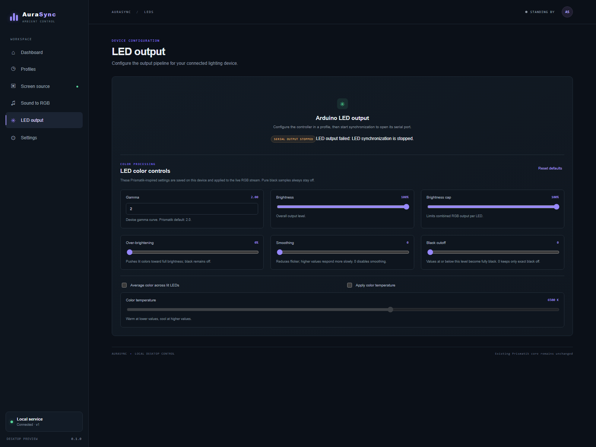
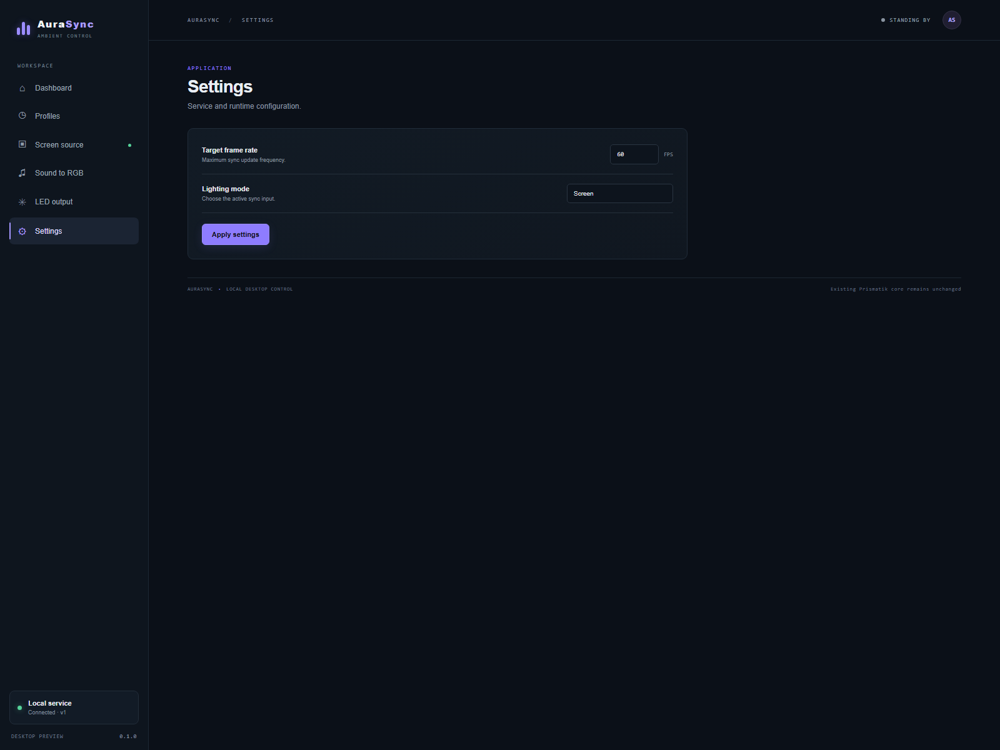

<h1 align="left">
  
  <span style="vertical-align:middle">AuraSync</span>
</h1>

AuraSync is a Windows desktop app that synchronizes addressable LEDs with a display. It combines an Angular interface, an Electron desktop host, and a local .NET 10 service.

> New to AuraSync or wiring a controller? Start with the **[AuraSync user guide](docs/user-guide.md)**. It includes a working Arduino Nano + WS2812 example, wiring instructions, and the firmware sketch.

## What it does

- Captures a selected Windows display and samples configurable LED zones around its edges.
- Saves and switches profiles containing the display, capture mode, and controller/layout settings.
- Supports Adalight and Ardulight serial output, with serial-port-aware frame-rate limiting and stale-frame dropping.
- Provides custom RGB effects, including static, blink, fade, rainbow, fire, color cycle, color wipe, theater chase, and breathing.
- Offers optional color processing such as brightness, gamma, smoothing, color temperature, and black cutoff.
- Includes Windows audio output capture and color-reactive modes where supported by the audio provider.
- Packages as a portable Windows x64 app or an NSIS installer.

## App pages

The app sidebar includes a **Legal notice** page with publisher information and pointers to the third-party notices shipped with the Windows package.

These screenshots were captured from the running AuraSync interface. The live display feed is available in the Electron desktop app; it is intentionally unavailable in a browser-only preview. What appears in profile-dependent controls can vary with the selected profile and connected hardware.

### Dashboard

At-a-glance view of the active setup, service health, and synchronization state.



### Profiles

Profile library and editor for capture sources, controller settings, and LED layout.



### Screen source

Display selection, monitor details, and preview status.



### Sound to RGB

Controls for sound-reactive lighting and audio color palettes.



### LED output

Serial output status and local LED color-processing controls.



### Settings

Application-wide synchronization frame rate and lighting-mode preferences.



## Quick start

### Use the desktop app

1. Install or launch the Windows desktop build.
2. Connect and configure an Arduino-compatible controller using the [user guide](docs/user-guide.md).
3. In **Profiles**, create a profile and select the display, lighting mode, controller protocol, COM port, baud rate, LED count, and layout.
4. Save or activate the profile, then select **Start sync** on the Dashboard.

## System requirements

### To run the packaged desktop app

- A **64-bit Windows 10 or Windows 11 PC**. AuraSync's published desktop build targets Windows x64.
- A display connected to Windows to use screen capture.
- An internet connection is not required for normal local operation after the app is installed.
- **Node.js and the .NET SDK are not required** to run the packaged app; its desktop dependencies and self-contained .NET service are included.

### To synchronize physical LEDs

- A compatible Arduino/serial LED controller connected over USB and configured for a supported AuraSync protocol (Adalight or Ardulight).
- An addressable RGB LED strip compatible with the controller firmware.
- A correctly rated external power supply for the LED strip. Do not power a large strip from the PC USB port or Arduino 5 V pin. See the [user guide](docs/user-guide.md) for the Nano + WS2812 wiring example and power-safety guidance.

LED hardware is only needed for physical light output; the app can be opened and used to manage its UI without a connected controller. Audio-reactive mode also requires an active Windows audio output device.

### Run from source

For development, use Windows 10/11, the .NET 10 SDK, and Node.js 22.22.3+ or 24.15.0+ with npm. NSIS with `makensis` on `PATH` is needed only to build the installer. These developer tools are not runtime requirements for the packaged app.

```powershell
npm install
npm run dev:desktop
```

Alternatively, run `run-dev.bat` from the repository root.

## Build and test

```powershell
npm run build:ui
npm run build:service
npm run package:win
dotnet test tests/service/LedSync.Application.Tests/LedSync.Application.Tests.csproj
```

The portable package is written to `apps/desktop/electron/release/dist/`. Run `win-publish.bat` to stage a portable copy in `release/AuraSync/` and create the NSIS installer.

## Architecture

```text
Angular renderer ── REST control + binary RGB WebSocket ── .NET 10 service
       │                                                   │
       └── secure desktop-capture IPC via Electron         └── Windows display,
                                                              audio, profile and serial adapters
                                                                  │
                                                            Arduino controller
```

- **Angular** owns UI, profiles and display selection, screen-edge sampling, RGB processing, effects, and service-client behavior.
- **Electron** owns windows, splash screen, secure capture IPC, local service lifecycle, and Windows packaging.
- **.NET API / Application / Domain / Infrastructure** own validated local endpoints, use cases, core models, persistence, and Windows display/audio/serial adapters.
- Configuration uses REST. High-frequency RGB frames use the local binary WebSocket at `/api/v1/sync/frames`.

The API binds only to `127.0.0.1:5078`. Profiles remain at `%LOCALAPPDATA%\LedSync\profiles.json` to preserve existing user data.

## Repository map

```text
apps/desktop/angular/                 Angular renderer
apps/desktop/electron/                 Electron host and packaging
apps/led-sync-service/                 .NET 10 service
contracts/api/openapi.yaml            REST API contract
docs/user-guide.md                    Setup, operation, and hardware guide
docs/architecture/overview.md         Component boundaries and data flows
.github/prompts/                      Repository-specific Copilot prompts
tests/                                Desktop, integration, and service tests
```

## Development guidelines

- Make a focused change in the component that owns the behavior; preserve the dependency direction Angular → local API and API → Application → Domain, with Infrastructure implementing ports.
- Keep profile JSON and API contracts compatible. Update `contracts/api/openapi.yaml` when public API shapes change.
- Add or adjust focused tests beside the affected behavior. Update the user guide or architecture overview when behavior, setup, or design changes.
- Validate with the smallest relevant type-check, test, or build; distinguish automated checks from physical hardware testing.
- Keep errors visible and actionable. Do not silently hide failed capture, serial, persistence, or API operations.

For system boundaries and runtime flows, see the [architecture overview](docs/architecture/overview.md).
